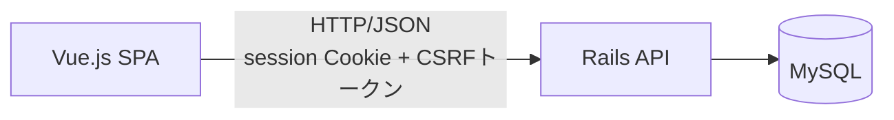

# inquiry-management


問い合わせ管理アプリ（学習用課題）

スクールの課題として、タスク管理アプリ(初級編)に続いて開発する。
タスク管理アプリ(初級編)とは異なる技術スタック(Ruby on Rails / Vue.js / MySQL)を用い、認証・テーブル関連付けという、自分にとって初めて取り組む要素を取り入れた問い合わせ管理システムを構築する。
フロントエンド/バックエンド/データベースの連携、REST APIの構造など、Webアプリケーションが動作する仕組みそのものへの理解を深めることも目的としている。

---

## デモ

### ログイン〜ボード画面(統計ダッシュボード・カンバン一覧)

https://github.com/user-attachments/assets/8c7f4183-b989-45fe-a062-9207473e4821

### 問い合わせ詳細の確認・編集

ステータス/優先度/担当者の変更、対応履歴・コメントの投稿。

https://github.com/user-attachments/assets/3b57b265-dcab-4d3a-85ca-1d1dcb53b990

### 顧客向け問い合わせフォーム〜確認メール

https://github.com/user-attachments/assets/a045d2f5-dfee-404c-874c-44212eb455bb

---

## 主な機能

- **スタッフ認証**:セッションCookie方式によるログイン/ログアウト
- **問い合わせボード**:未対応/対応中/完了のカンバン形式一覧。ドラッグ&ドロップまたはプルダウンでのステータス変更、優先度順/受付日時順ソート、未対応のまま24時間経過したカードの強調表示、20件ごとのページネーション(「もっと見る」で追加読み込み)
- **問い合わせ詳細**:ステータス・優先度・担当者の変更、対応履歴とコメントのやり取り(変更は自動でコメントとして記録)
- **顧客向け問い合わせフォーム**:キーワード検出による優先度自動設定、確認メール送信(開発環境ではletter_openerでブラウザプレビュー)
- **統計ダッシュボード**:ステータス別/カテゴリ別/担当者別の集計をボード画面上部に表示
- **レスポンシブ対応**:モバイル・タブレット幅でも閲覧・簡易操作が可能

## 技術スタック

| カテゴリ | 技術 | バージョン |
|---|---|---|
| フロントエンド | Vue.js(Composition API) | 3.5.40 |
| | TypeScript | 6.0.0 |
| | Vite | 8.1.5 |
| | Tailwind CSS | 4.3.3 |
| | Chart.js | 4.5.1 |
| バックエンド | Ruby on Rails(APIモード) | 8.1.3.1 |
| | Ruby | 3.4.10 |
| データベース | MySQL | 8.0 |
| インフラ | AWS EC2 + RDS(Terraformで構築) | - |

選定理由の詳細は[技術スタック](docs/tech-stack.md)を参照。

## ディレクトリ構成

```
inquiry-management/
├── backend/            # Ruby on Rails API(ポート 3000)
│   ├── app/models/            # Staff, Inquiry, Comment
│   ├── app/controllers/       # ApplicationController, SessionsController, StaffsController,
│   │                          # InquiriesController, CommentsController, StatsController
│   └── app/mailers/           # InquiryMailer(開発環境はletter_openerでブラウザプレビュー)
├── frontend/           # Vue.js + TypeScript + Vite(ポート 5173)
│   └── src/{components,composables,api,types,utils,views}
├── docker-compose.yml  # MySQL(ポート 3306)
├── docs/               # 要件・設計ドキュメント
└── terraform/          # AWSインフラ構成(EC2 + RDS、構築予定)
```

## アーキテクチャ

### アプリケーション構成

Vue.js(SPA)がRails APIへJSON形式でリクエストを送り、Railsが認証・ビジネスロジック・DBアクセスを担う構成。認証はセッションCookie方式で、書き込み系API(問い合わせ更新・コメント投稿)には別途CSRFトークン検証を設けている。



### インフラ構成(構築予定)

タスク管理アプリ(初級編)と同一のインフラ構成(EC2: t3.micro、RDS: db.t4g.micro)をTerraformで構築する方針。詳細は[AWSインフラ構成](docs/aws-infrastructure.md)を参照。

## 品質管理

### CI

PR作成時・mainへのpush時に、GitHub Actionsで以下を自動実行している([ci.yml](.github/workflows/ci.yml))。

- バックエンド:RuboCop(Lint)、Brakeman(セキュリティ静的解析)、bundler-audit(依存gemの脆弱性チェック)、テスト(minitest)
- フロントエンド:ESLint / oxlint(Lint)、vue-tsc(型チェック)、Vitest(テスト)

### 堅牢性・セキュリティ面の工夫

- **楽観ロック**:問い合わせ更新時、複数スタッフによる同時編集での上書き事故を防ぐ(`lock_version`)
- **CSRF対策**:書き込み系API(問い合わせ更新・コメント投稿)にセッション連動のCSRFトークン検証を実装
- **レート制限**:顧客向け問い合わせ登録APIに対し、同一IPからの連続送信を制限(Rack::Attack)し、誤操作の連続送信・bot対策とする

## 非機能要件

| 項目 | 内容 |
|---|---|
| 対応ブラウザ | Google Chrome / Microsoft Edge(いずれも最新版) |
| 性能要件 | 画面の初期表示3秒以内、登録・更新操作は1秒以内にレスポンス。想定問い合わせ件数は月間300件程度 |
| セキュリティ | パスワードは`has_secure_password`(bcrypt)でハッシュ化して保存。スタッフ用画面はログインセッションでアクセス制御。SQLインジェクション・XSS等の基本的な脆弱性対策を実施 |
| 可用性 | 個人開発規模のためSLAは定めず、EC2単一インスタンス構成のため自動フェイルオーバーは行わない |
| データバックアップ | RDSの自動バックアップ機能(AWSデフォルト設定)に従う |

詳細は[要件定義書](docs/requirements.md)を参照。

## スコープ外(発展課題)

学習負荷・追加費用のリスクとのバランスを判断し、以下は意図的にスコープ外とした。

| 項目 | 理由 |
|---|---|
| 本番環境での実際のメール配信(外部メールサービス連携) | 追加費用のリスクを考慮。仕組み自体(ActionMailerによる生成、開発環境でのプレビュー確認)は実装済みで、環境ごとに配送方法を切り替え可能な設計にしている |
| リアルタイム通信(チャット等) | 今回の要件(フォーム型の非同期な問い合わせ管理)には不要。将来の学習項目として位置づける |
| パスワード再設定機能(自動リセット画面) | スタッフアカウントの新規登録画面を設けない方針(小規模運用)と一貫させ、Railsコンソールでの管理者対応とする |
| 顧客向け問い合わせ状況照会ページ | 実用性・独自性は高いが、認証を伴わない検索機能の設計が追加で必要なため発展課題とする |

## 開発フロー

Issue作成 → ブランチ作成 → 実装 → 動作確認 → PR作成 → CI確認 → マージ、という流れを全ての変更(コードだけでなくドキュメントも含む)に例外なく適用している。本リポジトリはこのフローでIssue 36件・PR 48件を積み重ねてきた。

## セットアップ

### 前提

- Rubyは`rbenv`で管理する。バージョンは`backend/.ruby-version`(3.4.10)を参照
- 初回のみ`cd backend && bundle install`、`cd frontend && npm install`を実行する

### 起動手順

```bash
# 1. DB起動(リポジトリルートで実行)
docker compose up -d

# 2. バックエンド起動
cd backend
bin/rails server

# 3. フロントエンド起動(別ターミナル)
cd frontend
npm run dev
```

- バックエンド:`http://localhost:3000/up` で200 OKが表示されることを確認
- フロントエンド:`http://localhost:5173` でボード画面(未対応/対応中/完了の3カラム)が表示されることを確認

## APIエンドポイント

| メソッド | パス | 概要 | 認証 |
|---|---|---|---|
| GET | `/inquiries` | 問い合わせ一覧(status絞り込み、sort=priority\|created_at、20件ページネーション) | 必須 |
| GET | `/inquiries/:id` | 問い合わせ詳細(対応履歴・コメントを時系列で含む) | 必須 |
| POST | `/inquiries` | 問い合わせ登録(顧客向け、キーワード検出による優先度自動設定・確認メール送信を含む) | 不要 |
| PATCH | `/inquiries/:id` | ステータス/優先度/担当者の更新(楽観ロック、変更時に自動記録コメントを追加) | 必須 |
| GET | `/staffs` | 担当者ドロップダウン用の一覧(id/nameのみ) | 必須 |
| POST | `/session` | ログイン | 不要 |
| DELETE | `/session` | ログアウト | 必須 |
| GET | `/session` | ログイン中スタッフの確認 | 必須 |
| POST | `/inquiries/:id/comments` | コメント投稿(投稿者はログイン中スタッフに固定) | 必須(CSRF検証あり) |
| GET | `/stats` | 統計ダッシュボード用データ(ステータス別/カテゴリ別/担当者別集計) | 必須 |

## ドキュメント

- [要件定義書](docs/requirements.md)
- [機能要件定義書](docs/functional-requirements.md)
- [データベース設計書](docs/database-design.md)
- [画面設計書](docs/screen-design.md)
- [技術スタック](docs/tech-stack.md)
- [AWSインフラ構成](docs/aws-infrastructure.md)
