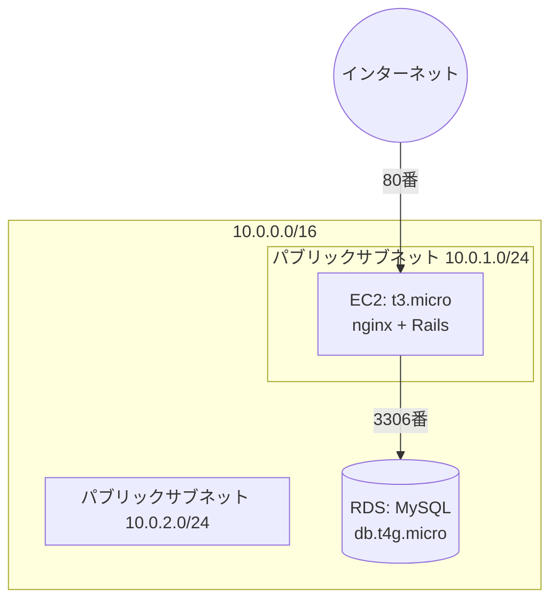

# AWSインフラ構成

## 1. 方針

前回(タスク管理アプリ)で構築したAWSインフラ(EC2 + RDS + Terraform)と同じ構成(EC2: t3.micro、RDS: db.t4g.micro)を使用する。DBエンジン・アプリケーション実行環境の設定のみ、今回の技術スタック(Ruby on Rails / MySQL)に合わせて変更する。

前回のTerraformコード(`task-management/terraform/`)を土台とし、`.tf`ファイルのみをコピーして新規に`terraform init`から構築する。前回の`.terraform`ディレクトリ・`terraform.tfstate`(前回の実際のAWSリソースと紐づく状態ファイル)はコピーしない。

---

## 2. 構成



| リソース | 内容 |
|---|---|
| VPC | 10.0.0.0/16、パブリックサブネット2つ(前回と同一構成) |
| EC2 | t3.micro(無料枠対象)、nginx + Ruby on Rails |
| RDS | **MySQL**(前回はPostgreSQL)、db.t4g.micro、単一AZ、非公開 |
| セキュリティグループ | SSH(22)/80番は自分のIPのみ許可。RDSは**3306番**(前回は5432番)をEC2のみ許可 |

---

## 3. 前回からの変更点

| ファイル | 変更内容 |
|---|---|
| `variables.tf` | `project_name`のデフォルト値を`inquiry-management`に変更 |
| `rds.tf` | `engine = "postgres"` → `"mysql"`、`engine_version`をMySQL用に変更 |
| `security_groups.tf` | RDS用SGのポートを5432→3306に変更。EC2用SGのアプリケーションポートをRailsのポート(例: 3000番、Rails単体で動かす場合)に応じて調整 |
| `ec2.tf` | user_data内のインストール対象を、Java/SDKMANからRuby(rbenv等)に変更。Node.jsはVue.jsのフロントエンドビルド用に引き続き必要 |
| SSHキー | `~/.ssh/task-management-key.pub`とは別に、`~/.ssh/inquiry-management-key.pub`を新規作成して使用 |

---

## 4. 今回のスコープに含めないもの

| 項目 | 理由 |
|---|---|
| AWS SES等の外部メール送信サービスとの連携 | 追加費用のリスクを考慮し、今回は開発環境でのメール内容プレビュー確認までとし、本番連携は発展課題として扱う |

---

## 5. 無料枠に関する注意事項

- EC2(t3.micro)・RDS(db.t4g.micro、20GB gp3)は、前回同様AWS無料利用枠の対象範囲内で構成する
- 新規の外部サービス(メール配信サービス等)は導入しないため、追加費用が発生する要素はない
- EC2のCPUクレジットは`ec2.tf`で`standard`に固定している。AWSのデフォルトである`unlimited`のままだと、クレジットを使い切った後もベースラインを超えて動作し続け、その超過分が無料枠外の課金対象になる(Rubyのソースビルドのような高負荷処理でクレジットを使い切った際に実際に発生した)

---

## 6. デプロイ時の注意点(実機検証で判明したもの)

前回(task-management)はJavaをSDKMAN経由でビルド済みバイナリとして導入していたのに対し、今回のRuby(rbenv+ruby-build)はソースからのビルドになるため、t3.microの限られたリソースで以下の問題が実際に発生した。`ec2.tf`のuser_dataで対応済みだが、他の言語・構成でEC2上でのビルドを行う場合は同様の問題が起きうるため記録しておく。

- **メモリ不足によるビルド失敗**: t3.micro(メモリ1GB、スワップなし)でRubyをソースビルドすると、OOM Killerがgccのプロセスを強制終了させビルドが失敗する。`user_data`でスワップ領域(2GB)を追加し、ビルドの並列数(`MAKE_OPTS`)を1に制限することで解消した
- **`/tmp`の容量不足によるビルド失敗**: Amazon Linux 2023の`/tmp`はtmpfs(メモリ上、約459MBが上限)で、ディスク自体は空きがあってもビルド中の一時ファイルがここに書き込まれて溢れる。`TMPDIR`をディスク上の`/var/tmp`に変更することで解消した
- **`rsync`が標準で入っていない**: デプロイスクリプト(`scripts/deploy-backend.sh`)でのソース転送は、Amazon Linux 2023に標準で入っていない`rsync`ではなく`tar`+`ssh`を使っている
- **nginx.conf組み込みのデフォルトサーバーブロックとの競合**: Amazon Linux 2023のnginxパッケージは、`conf.d/default.conf`ではなく`nginx.conf`本体に`server_name _;`のデフォルトサーバーブロックを直接含んでいる。`deploy/nginx/inquiry-management.conf`と競合するため、デプロイスクリプトで無効化している
- **本番DBに初回スタッフアカウントが存在しない**: `db/seeds.rb`は`return unless Rails.env.development?`で本番実行を意図的にガードしているため、`db:prepare`だけでは本番にスタッフアカウントが1件も作成されない。初回は以下のように`rails runner`で手動作成する必要がある

  ```bash
  ssh -i ~/.ssh/inquiry-management-key ec2-user@<EC2のIP> "
    cd /opt/app/backend &&
    set -a && source .env.production && set +a &&
    bundle exec rails runner '
      Staff.create!(name: \"担当者名\", email: \"staff@example.com\", password: \"十分な強度のパスワード\")
    '
  "
  ```

---

## 7. HTTPS化の方針

### 7.1 HTTPS化する理由

本アプリはスタッフの認証パスワード、顧客の氏名・メールアドレス・電話番号を扱う。5節までの構成(HTTPのみ)では、これらが通信経路上で平文のまま流れるため、通信を観測できる立場の第三者に漏洩するリスクがある。セキュリティグループでアクセス元を限定しているため実害は限定的だが、パスワード・個人情報を扱うアプリとしては対応する。

### 7.2 検討した選択肢

| 選択肢 | 評価 |
|---|---|
| ACM + ALB + 独自ドメイン | 証明書自体は無料だが、ALBが月$16〜20程度の常時課金になる。本プロジェクトは検証後に破棄する前提であり、投資に見合わない |
| CloudFront(`*.cloudfront.net`)+ ACM | ドメイン取得は不要だが、新たなAWSサービスが増え、動的なAPIに対するキャッシュ制御の考慮が必要になる。無料枠(アカウント作成から12か月)の残り期間も不確実 |
| sslip.io等のIP埋め込み型ドメイン | セットアップは最も簡単だが、ドメイン名にIPアドレスが埋め込まれるため、EC2再作成でIPが変わるたびにドメイン名自体を変更する必要がある。本プロジェクトはRubyビルドの都合で実際に複数回EC2を作り直しており、相性が悪い |
| DuckDNS(無料の動的DNS)+ Let's Encrypt | 採用。無料でTLS証明書(暗号強度はACMと同等)を取得でき、EC2のIPが変わってもDuckDNS側の向き先を更新するだけで運用を継続できる |

### 7.3 この方針の限界

DuckDNSのサブドメイン(`*.duckdns.org`)は、独自ドメインを購入する構成と比べ、商用サービスとしての体裁やDNS基盤としての安定性で劣る。本プロジェクトは学習目的で完成後に破棄する前提のため許容しているが、本格的に長期運用するサービスへ発展させる場合は、独自ドメインの購入を含めた構成の見直しが必要になる。
