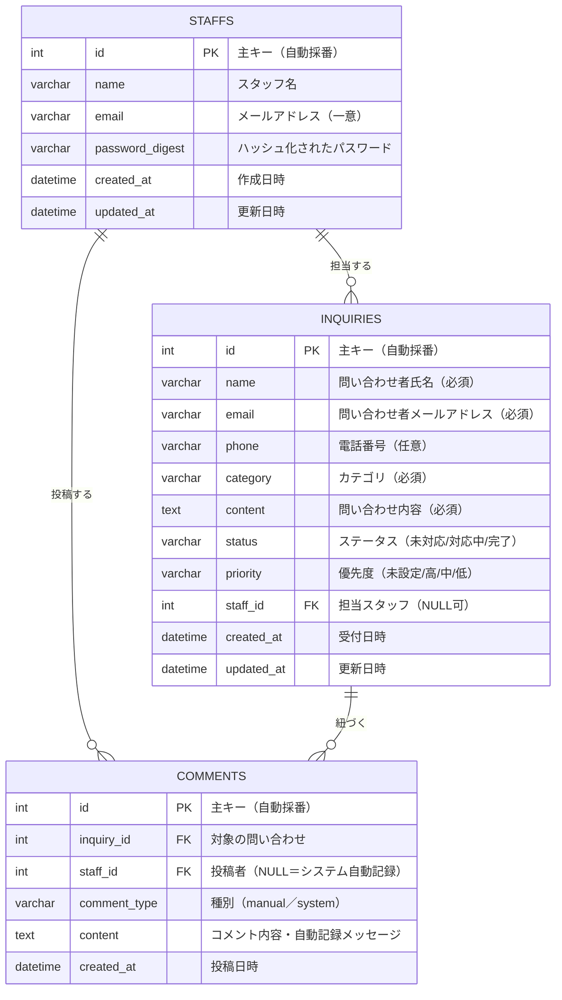

# データベース設計書

## 1. ER図

---

## 2. テーブル定義

### 2.1 staffs テーブル(スタッフ)

| カラム名 | データ型 | NULL | 初期値 | 説明 |
|----------|---------|------|--------|------|
| id | INT | 不可 | 自動採番 | 主キー |
| name | VARCHAR(255) | 不可 | なし | スタッフ名 |
| email | VARCHAR(255) | 不可 | なし | ログイン用メールアドレス(一意) |
| password_digest | VARCHAR(255) | 不可 | なし | ハッシュ化されたパスワード(`has_secure_password`により自動生成) |
| created_at | DATETIME | 不可 | 現在日時 | 作成日時 |
| updated_at | DATETIME | 不可 | 現在日時 | 更新日時 |

### 2.2 inquiries テーブル(問い合わせ)

| カラム名 | データ型 | NULL | 初期値 | 説明 |
|----------|---------|------|--------|------|
| id | INT | 不可 | 自動採番 | 主キー |
| name | VARCHAR(255) | 不可 | なし | 問い合わせ者の氏名 |
| email | VARCHAR(255) | 不可 | なし | 問い合わせ者のメールアドレス |
| phone | VARCHAR(20) | 可 | NULL | 電話番号 |
| category | VARCHAR(50) | 不可 | なし | カテゴリ：`料金プラン` / `使い方` / `解約` / `不具合` / `その他` |
| content | TEXT | 不可 | なし | 問い合わせ内容 |
| status | VARCHAR(20) | 不可 | `未対応` | ステータス：`未対応` / `対応中` / `完了` |
| priority | VARCHAR(10) | 可 | `未設定` | 優先度：`未設定` / `高` / `中` / `低` |
| staff_id | INT | 可 | NULL | 担当スタッフ(staffsテーブルへの外部キー) |
| created_at | DATETIME | 不可 | 現在日時 | 受付日時(並び替え・経過時間判定に使用) |
| updated_at | DATETIME | 不可 | 現在日時 | 更新日時 |

### 2.3 comments テーブル(対応履歴・コメント)

| カラム名 | データ型 | NULL | 初期値 | 説明 |
|----------|---------|------|--------|------|
| id | INT | 不可 | 自動採番 | 主キー |
| inquiry_id | INT | 不可 | なし | 対象の問い合わせ(inquiriesテーブルへの外部キー) |
| staff_id | INT | 可 | NULL | 投稿したスタッフ(NULLの場合はシステムによる自動記録) |
| comment_type | VARCHAR(10) | 不可 | `manual` | `manual`(手動コメント) / `system`(自動記録) |
| content | TEXT | 不可 | なし | コメント内容、またはシステムによる自動生成メッセージ(例:「ステータスが未対応→対応中に変更されました」) |
| created_at | DATETIME | 不可 | 現在日時 | 投稿日時 |

---

## 3. インデックス

| インデックス名 | 対象テーブル | 対象カラム | 用途 |
|--------------|-----------|-----------|------|
| idx_inquiries_status | inquiries | status | ステータス別の一覧取得の高速化 |
| idx_inquiries_staff_id | inquiries | staff_id | 担当者別の集計・絞り込みの高速化 |
| idx_inquiries_created_at | inquiries | created_at | 受付日時順の並び替え・経過時間判定の高速化 |
| idx_comments_inquiry_id | comments | inquiry_id | 特定の問い合わせに紐づく履歴・コメント取得の高速化 |

---

## 4. 制約・関連

- `category` は `料金プラン` / `使い方` / `解約` / `不具合` / `その他` のいずれかの値をとる(必須)
- `status` は `未対応` / `対応中` / `完了` のいずれかの値をとる(必須)
- `priority` は `未設定` / `高` / `中` / `低` のいずれかの値をとる(任意)
- `inquiries.staff_id` は `staffs.id` を参照する外部キー(担当者未割り当ての場合はNULL)
- `comments.inquiry_id` は `inquiries.id` を参照する外部キー(削除時は関連するコメントも削除する想定)
- `comments.staff_id` は `staffs.id` を参照する外部キー(システム自動記録の場合はNULL)
- 前回(タスク管理)は`tasks`単一テーブルの構成だったが、今回は3テーブル間の関連付け(1対多)を新規に導入する
