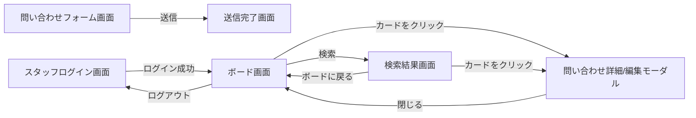

# 画面設計書

## 1. 画面一覧

| No. | 画面名 | 概要 | 利用者 | レスポンシブ対応 |
|-----|--------|------|------|---|
| 1 | 問い合わせフォーム画面 | 顧客が問い合わせを入力・送信する | 顧客 | ○(スマホ/タブレット/PC) |
| 2 | 送信完了画面 | 送信後に表示される完了メッセージ画面 | 顧客 | ○ |
| 3 | スタッフログイン画面 | メール・パスワードでログインする | スタッフ | ○ |
| 4 | ボード画面 | 統計ダッシュボード＋カンバン形式の問い合わせ一覧、ログアウト操作 | スタッフ | △(PC主体、スマホは閲覧・簡易操作に対応) |
| 5 | 問い合わせ詳細/編集モーダル | 内容確認、ステータス/優先度/担当者の変更、対応履歴・コメントの閲覧/投稿 | スタッフ | △(PC主体) |
| 6 | 検索結果画面 | 検索ボックスで氏名・メール・内容を横断検索した結果を一覧表示する | スタッフ | △(PC主体、スマホは閲覧・簡易操作に対応) |

---

## 2. 画面遷移図



モーダル(E)を開いている間は、ステータス/優先度/担当者の変更・コメントの投稿を続けて行える(閉じずに複数回操作可能)。

---

## 3. ワイヤーフレーム

### 3-1. 問い合わせフォーム画面

```
┌─────────────────────────────────┐
│  お問い合わせフォーム              │
│                                   │
│  氏名（必須）                     │
│  ┌─────────────────────────┐    │
│  └─────────────────────────┘    │
│  メールアドレス（必須）            │
│  ┌─────────────────────────┐    │
│  └─────────────────────────┘    │
│  電話番号（任意）                 │
│  ┌─────────────────────────┐    │
│  └─────────────────────────┘    │
│  カテゴリ（必須） [選択してください ▼]│
│  お問い合わせ内容（必須）          │
│  ┌─────────────────────────┐    │
│  │                         │    │
│  └─────────────────────────┘    │
│                                   │
│           [送信する]              │
└─────────────────────────────────┘
```

- スマートフォンでは縦一列のレイアウトに自動調整する(Tailwind CSSのレスポンシブユーティリティを使用)

### 3-2. 送信完了画面

```
┌─────────────────────────────┐
│                               │
│   お問い合わせありがとうございました │
│   確認のご連絡までしばらく     │
│   お待ちください               │
│                               │
└─────────────────────────────┘
```

### 3-3. スタッフログイン画面

```
┌─────────────────────────────┐
│      問い合わせ管理システム     │
│      スタッフ専用ログイン      │
│                               │
│  メールアドレス                │
│  ┌───────────────────────┐   │
│  └───────────────────────┘   │
│  パスワード                    │
│  ┌───────────────────────┐   │
│  └───────────────────────┘   │
│                               │
│         [ログイン]            │
└─────────────────────────────┘
```

### 3-4. ボード画面(PC表示)

```
┌──────────────────────────────────────────────────────────┐
│  問い合わせボード                ログイン中: 田中 [ログアウト]│
│  [🔍 名前・メール・問い合わせ内容で検索        ] [検索]        │
│                                                            │
│  [統計] 未対応:5件 対応中:3件 完了:20件  ［棒グラフ表示］     │
│  [担当者別・未完了件数] 田中:4件 佐藤:3件 鈴木:1件            │
│                                                            │
│  未対応              対応中              完了               │
│  [優先度順]           [優先度順]           [優先度順]        │
│  ─────────           ─────────           ───────           │
│  🔴問い合わせ①         問い合わせ②         （20件表示、もっと見る）│
│  山田太郎              佐藤花子                             │
│  カテゴリ: 料金プラン    カテゴリ: 解約                       │
│  優先度: 高            優先度: 中                            │
│  担当: 未割当          担当: 田中                            │
│  ※24h以上未対応のため赤で強調                                │
└──────────────────────────────────────────────────────────┘
```

- カードはドラッグ&ドロップでカラム間を移動でき、移動するとステータスが自動更新される
- 「未対応」のまま24時間以上経過したカードは赤系の枠・背景で強調表示する
- 「完了」は直近30日以内に更新されたものだけを表示する(30日を超えたものは検索機能から探せる)

### 3-5. ボード画面(スマートフォン表示)

```
┌───────────────────┐
│ 問い合わせボード [ログアウト]│
│ [🔍 検索          ]│
│ [統計] 未対応:5 対応中:3│
│                     │
│ [未対応 ▼]（カラム切替）│
│ ─────────           │
│ 🔴問い合わせ①         │
│ 山田太郎             │
│ カテゴリ: 料金プラン   │
│ 優先度: 高            │
│ 担当: 未割当          │
│ [ステータス変更 ▼]    │
└───────────────────┘
```

- 各カードには氏名・カテゴリ・優先度・担当者を、PC表示と同様にすべて表示する(画面幅による項目の省略は行わない)
- 画面幅が狭い場合、カラムを横並びではなくプルダウンで切り替える表示に変更する
- ドラッグ&ドロップの代わりに、ステータス変更用のプルダウンを表示する

### 3-6. 問い合わせ詳細/編集モーダル

```
┌─────────────────────────────┐
│ 問い合わせ詳細  山田太郎    [×] │
│ 🔴24時間経過(未対応が続く場合)  │
│                               │
│ ┌─ 対応状況 ─────────────┐    │
│ │ ステータス: [対応中 ▼]   │    │
│ │ 優先度: [高 ▼]           │    │
│ │  （キーワード検出により自動設定）│
│ │ 担当者: [田中 ▼]         │    │
│ └───────────────────────┘    │
│                               │
│ 氏名: 山田太郎                 │
│ メール: yamada@example.com    │
│ 電話番号: 090-xxxx-xxxx        │
│ カテゴリ: 料金プラン             │
│                               │
│ 内容                          │
│ ┌───────────────────────┐    │
│ │ 月額プランの詳細を知り    │    │
│ │ たいです。               │    │
│ └───────────────────────┘    │
│                               │
│ ── 対応履歴・コメント ──        │
│ 2026-07-30 10:00               │
│  ステータスが未対応→対応中に    │
│  変更されました（自動記録）      │
│                               │
│ 2026-07-30 10:15  田中          │
│  「お客様に電話で確認済み。    │
│   来週対応予定」               │
│                               │
│ ┌───────────────────────┐    │
│ │ 新しいコメントを入力...   │    │
│ └───────────────────────┘    │
│           [追加する]           │
│                               │
│              [閉じる]          │
└─────────────────────────────┘
```

- 削除ボタンは設けない(タスク管理アプリ(初級編)との明確な違い。実務にならい記録として保持する方針)

### 3-7. 検索結果画面

```
┌─────────────────────────────────┐
│ ← ボードに戻る                    │
│                                   │
│ 検索結果  2件                     │
│ ─────────────────────           │
│ 山田太郎                          │
│ カテゴリ: 料金プラン  優先度: 高    │
│ 担当: 未割当                      │
│                                   │
│ 鈴木一郎                          │
│ カテゴリ: 使い方  優先度: 未設定    │
│ 担当: 佐藤 花子                    │
│                                   │
│         [もっと見る]              │
└─────────────────────────────────┘
```

- ボード画面の検索ボックスで検索を実行すると、この画面に遷移する
- ステータス・受付日時に関わらず全件が検索対象(ボード画面の「完了」30日フィルタは適用しない)
- カードをクリックすると、ボード画面と同じ問い合わせ詳細/編集モーダルが開く
- 「← ボードに戻る」リンクからボード画面に戻れる
